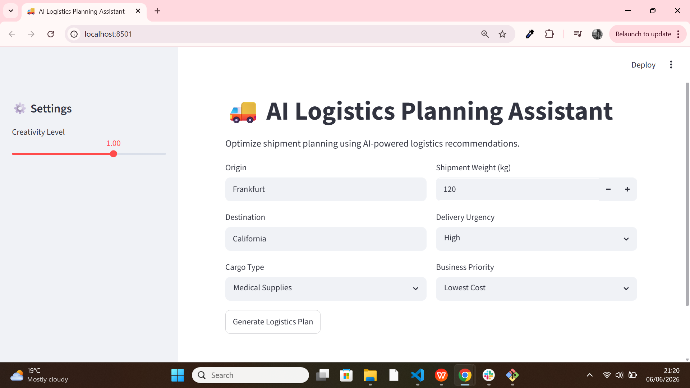
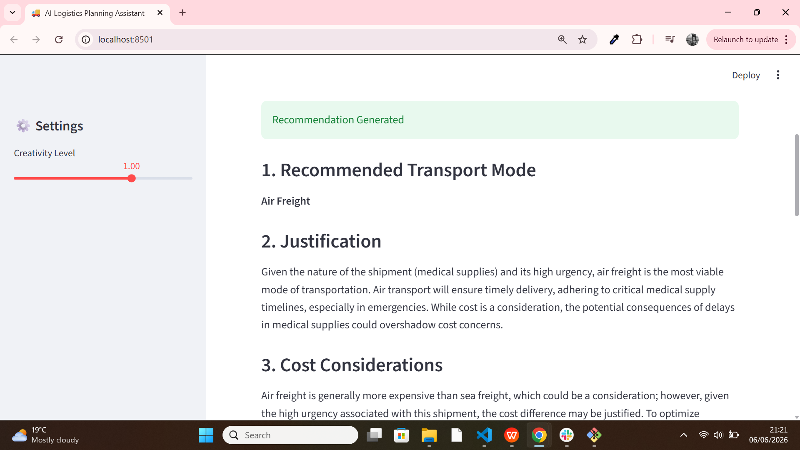

# 🚚 LogiLLM Control Tower



AI-powered logistics planning and shipment decision support platform built with **Python**, **Streamlit**, and **OpenAI**.

## Overview

LogiLLM Control Tower helps logistics and supply chain professionals evaluate shipment requirements and generate intelligent transportation recommendations based on business priorities, urgency, cargo characteristics, and operational considerations.

## Features

- 🚛 Transport mode recommendations (Road, Rail, Air, Sea)
- 💰 Cost vs. speed trade-off analysis
- ⚠️ Shipment risk assessment
- 🌱 Sustainability insights
- 📊 Executive logistics summaries
- 🤖 AI-powered decision support

## Tech Stack

- Python
- Streamlit
- OpenAI API
- python-dotenv

### AI Recommendation Output



## Run Locally

Install dependencies:

```bash
pip install -r requirements.txt
```

Create a `.env` file:

```env
OPENAI_API_KEY=your_api_key_here
```

Start the application:

```bash
streamlit run logistics_ai_assistant.py
```

## Current Version

**MVP (Minimum Viable Product)**

The current release focuses on AI-assisted shipment planning, transportation mode recommendations, operational risk assessment, and sustainability guidance.

## Roadmap

### Version 2
- Shipment database integration (SQLite)
- Order creation and management
- Shipment status tracking
- Historical shipment records

### Version 3
- Logistics KPI dashboards
- CSV shipment uploads
- Delay prediction models
- AI-powered supply chain analytics
- Business intelligence reporting

## Business Value

This project demonstrates how Large Language Models (LLMs) can support logistics planning and transportation decision-making by providing fast, data-driven recommendations for supply chain operations.

## Author

**Selasey Dick Junior Gbeddy**

Supply Chain Analytics | Logistics Technology | AI Applications in Operations

